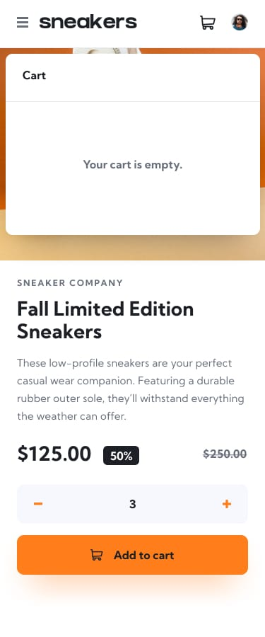
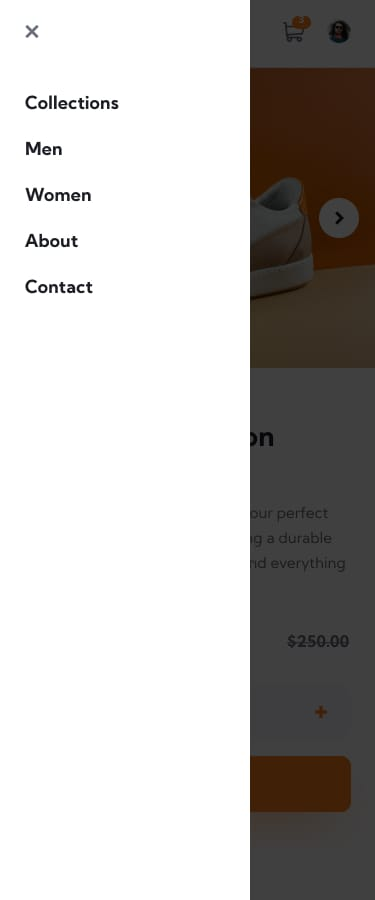

# 🛒 E-commerce Product Page

This is a solution to the [E-commerce Product Page challenge on Frontend Mentor](https://www.frontendmentor.io/challenges/ecommerce-product-page-UPsZ9MJp6). It focuses on building an interactive product display page with features like image gallery, cart management, responsive layout, and lightbox support.

---

## 📋 Table of Contents

- [Overview](#overview)
  - [Screenshots](#screenshots)
  - [Live Links](#live-links)
  - [Built With](#built-with)
- [Author](#author)

---

## Overview

Users should be able to:

- View the optimal layout for the page on different screen sizes.
- Hover on interactive elements to see hover/focus states.
- Open a lightbox gallery by clicking the main product image.
- Change the main product image by clicking the thumbnails.
- Add items to the cart and manage cart quantity.
- View and remove items in the cart.

---

### Screenshots

#### 🖥️ Desktop Lightbox View

#### 🧺 Basket Filled (Desktop)

#### 📱 Mobile Basket Empty

#### 📱 Mobile Menu View

---

### Live Links

- 📁 GitHub Repository: [E-commerce Product Page](https://github.com/vedantagrawal524/ecommerce-product-page)
- 🌐 Live Site: [https://ecommerce-product-page524.vercel.app/](https://ecommerce-product-page524.vercel.app/)

---

### Built With

- HTML5
- CSS3
- Flexbox
- Grid Layout
- JavaScript
- Media Queries
- [Vercel](https://vercel.com/) for deployment

---

## Author

- Portfolio – _Vedant Agrawal_
- Frontend Mentor – [@vedantagrawal524](https://www.frontendmentor.io/profile/vedantagrawal524)
- GitHub – [@vedantagrawal524](https://github.com/vedantagrawal524)

---

📌 _If you found this project useful, feel free to fork it, give a ⭐, or drop your feedback. Happy coding!_
